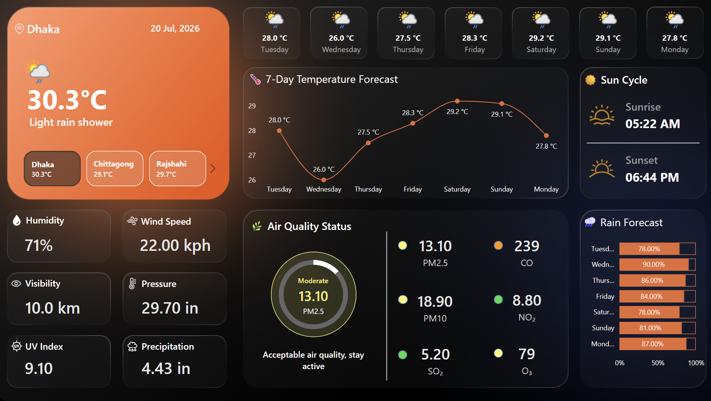

# 🌦️ Weather & Air Quality Monitoring Dashboard

### *One glance. Six cities. Every condition that matters.*

<p align="center">

[]()
[]()
[]()

</p>

🔗 **[🌤 View Live Dashboard](https://app.powerbi.com/links/nqrilG-n5C?ctid=72a00c12-baf3-47eb-963b-273fb99e18ae&pbi_source=linkShare)**

---

# 📌 Project Overview & Motivation

Every day, people make decisions based on weather and environmental conditions:

*"Will it rain today?"*  
*"Is the air quality safe?"*  
*"Should I plan outdoor activities?"*

However, obtaining these answers often requires checking multiple platforms for weather forecasts, pollution levels, and environmental updates.

This project aims to simplify that process by developing an **interactive Weather and Air Quality Monitoring Dashboard using Microsoft Power BI**, combining real-time meteorological and environmental information into a single, user-friendly platform. The dashboard integrates live data from **[WeatherAPI](https://www.weatherapi.com/)** to provide comprehensive weather and air quality insights across six major cities in Bangladesh: Dhaka, Chittagong, Rajshahi, Barisal, Khulna, and Rangpur.

The objective of this dashboard is not only to display weather statistics, but to transform raw API data into meaningful insights that users can understand quickly.

The dashboard provides:

- 🌡 **Current Weather Conditions**  
  Temperature, humidity, wind speed, UV index, visibility, and atmospheric pressure.

- 📅 **7-Day Weather Forecast**  
  Future temperature trends dynamically updated based on the current date.

- 🌧 **Rain Forecast**  
  Daily precipitation probability to support outdoor planning.

- 🌅 **Sun Cycle Information**  
  Sunrise and sunset timings for each selected city.

- 🌫 **Air Quality Monitoring**  
  Analysis of major pollutants including:
  - PM2.5
  - PM10
  - CO
  - NO₂
  - SO₂
  - O₃

The goal was to transform complex environmental data into an intuitive dashboard that communicates not only **what the conditions are**, but also **what actions users can take**.

---

# ✨ Key Features

| Feature | Description |
|---|---|
| 🌡 Current Weather Monitoring | Displays real-time temperature, humidity, wind speed, UV index, visibility, and pressure |
| 📅 7-Day Forecast | Provides upcoming temperature trends automatically updated from live API data |
| 🌧 Rain Probability | Shows daily precipitation chances for future planning |
| 🌅 Sun Cycle Tracking | Displays sunrise and sunset information |
| 🌫 Air Quality Monitoring | Tracks PM2.5, PM10, CO, NO₂, SO₂, and O₃ levels |
| 🏙 Multi-City Analysis | Allows comparison between six major cities in Bangladesh |
| 🎨 Interactive Dashboard | Uses modern visual elements, icons, and conditional formatting for better interpretation |

---

# ⚙️ Development Process

## 1. Data Acquisition

The dashboard uses **WeatherAPI** as the primary data source to retrieve real-time meteorological and environmental information.

The API provides:

- Current weather conditions
- 7-day forecast data
- Hourly forecast information
- Air quality measurements

The data is retrieved in **JSON format** and directly integrated into Power BI for transformation, modelling, and visualization.

Key parameters collected include:

- Temperature
- Humidity
- Wind speed
- Visibility
- UV index
- Atmospheric pressure
- Rain probability
- Sunrise and sunset timing
- Air pollutant concentration

---

## 2. Data Transformation

Raw API responses contain nested JSON structures that require preprocessing before analysis.

Using **Power Query Editor**, the following transformations were performed:

- Expanded nested JSON objects into structured tables.
- Converted timestamps into readable date and time formats.
- Standardized numerical, categorical, and date/time data types.
- Removed unnecessary fields and redundant columns.
- Cleaned and prepared the dataset for efficient analysis.

The dataset was organized into separate analytical tables:

| Table | Purpose |
|-|-|
| Current Weather Data | Stores real-time weather conditions |
| Forecast Data | Contains daily weather predictions |
| Hourly Forecast Data | Provides detailed hourly weather information |
| Air Quality Data | Stores pollutant measurements |
| Locations Table | Controls city-based filtering |

A consolidated data structure was created to support efficient city-level analysis and allow future expansion to additional locations.

---

## 3. Data Modelling

A structured data model was developed to ensure accurate filtering and efficient dashboard performance.

Key modelling steps:

- Created a dedicated **Locations dimension table**.
- Established relationships between:
  - Locations
  - Current Weather Data
  - Forecast Data
  - Air Quality Data
- Configured filter propagation so selecting a city automatically updates all dashboard visuals.
- Hidden supporting tables and intermediate queries to maintain a cleaner Power BI model.

### Data Flow Architecture

```
WeatherAPI
     |
     |
 JSON Response
     |
     |
Power Query
(Data Cleaning & Transformation)
     |
     |
Power BI Data Model
(Current + Forecast + Air Quality Tables)
     |
     |
Interactive Dashboard
```

---

# 🎨 Dashboard Design & Visualization

The dashboard was designed with a modern dark theme to improve readability and create a visually engaging user experience.

## KPI Cards

Key weather indicators displayed:

- Current Temperature
- Humidity
- Wind Speed
- Visibility
- UV Index
- Air Quality Index

---

## Forecast Visualization

A temperature forecast line chart was developed to display:

- Upcoming 7-day temperature trends
- Automatic weekday adjustment based on current date
- Clear comparison between forecasted temperatures

---

## Air Quality Analysis

The dashboard monitors major pollutants:

- PM2.5
- PM10
- CO
- NO₂
- SO₂
- O₃

Dynamic colour indicators were implemented:

| Colour | Air Quality Level |
|-|-|
| 🟢 Green | Good |
| 🟡 Yellow | Moderate |
| 🟠 Orange | Unhealthy |
| 🔴 Red | Hazardous |

---

## Rain Forecast Visualization

A horizontal bar chart was created to display:

- Daily rain probability
- Upcoming precipitation trends
- Weather planning insights

---

# 📐 DAX & Analytics Implementation

Custom DAX measures were created to enhance dashboard functionality and improve user interpretation.

## Temperature Display Measure

```DAX
Temperature =
ROUND(
    SELECTEDVALUE(Forecast[avgtemp_c]),
    1
) & " °C"
```

---

## PM2.5 Dynamic Colour Measure

```DAX
PM25_Color =
VAR Value =
SELECTEDVALUE(AirQuality[pm2_5])

RETURN

SWITCH(
    TRUE(),
    Value <= 50, "#43d946",
    Value <= 100, "#fff570",
    Value <= 150, "#ff9800",
    Value <= 200, "#d93343",
    "#8b0000"
)
```

These measures allow the dashboard to automatically classify pollutant levels and provide immediate visual feedback.

---

# 📊 Key Insights

## 🌡 Weather Trends

- Temperature patterns vary across different regions of Bangladesh.
- Coastal regions such as Chittagong show different weather characteristics compared with northern regions such as Rangpur.
- The 7-day forecast enables users to anticipate upcoming weather conditions.

---

## 🌫 Air Quality Monitoring

- Pollutant measurements provide visibility into environmental conditions across different cities.
- PM2.5 and CO act as important indicators for monitoring pollution severity.
- The colour-based AQI classification allows users to quickly identify potential air quality concerns.

---

## 🌧 Weather Planning

- Rain probability forecasting helps users plan outdoor activities.
- Sunrise and sunset information provides additional context for daily scheduling.

---

# 📷 Dashboard Snapshot



---

# 🛠 Tools & Technologies

| Category | Tools |
|-|-|
| Data Visualization | Microsoft Power BI |
| Data Transformation | Power Query |
| Analytics | DAX |
| Data Source | WeatherAPI |
| Data Format | JSON |
| Deployment | Power BI Service |


---

# 🎯 Skills Demonstrated

This project demonstrates practical experience in:

- Real-time API integration
- JSON data processing
- Data cleaning and transformation
- Power BI data modelling
- DAX measure development
- Dashboard storytelling
- Interactive visualization design
- Environmental data analytics

---

# 🔗 References

- WeatherAPI Documentation  
https://www.weatherapi.com/docs/

- Microsoft Power BI Documentation  
https://learn.microsoft.com/en-us/power-bi/

---

## 👨‍💻 Author

**Ayaz Rahman**  

Power BI | Data Analytics | Data Visualization
